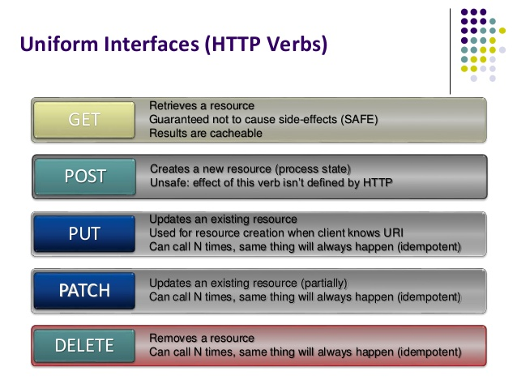

[](https://generalassemb.ly/education/web-development-immersive)

# HTTP Study

## Objectives

By the end of this, students should be able to:

-   Diagram the request-response flow between a client and server
-   Identify the different parts of a Universal Resource Location (URL)
-   Identify the different parts of a request
-   Identify the different parts of a response
-   Make web request outside the browser using `curl`

## HTTP

HTTP is a protocol - a system of rules - that determines how documents are
transferred from one place to another. Among other things, it defines the format
of the messages passed between *clients* and *servers*.

#### HTTP Clients

Send *requests* and receive *responses*. Examples include browsers
(like __Chrome__, __Safari__, or __Firefox__) and other programs like
[`httpie`](https://github.com/jkbrzt/httpie), 
[`curl`](http://curl.haxx.se/docs/) and
[`wget`](http://www.gnu.org/software/wget/manual/wget.html).

#### HTTP Servers
Receive requests and send responses. 

There are WEB/HTTP servers like [Apache](http://httpd.apache.org/), [nginx](http://nginx.com/),[lighttpd](https://www.lighttpd.net) and the WEBRick Ruby HTTP Server.

> 

1.  A HTTP Client sends a HTTP Request to a server machine that is running a HTTP Server on a specific port.
1.  The HTTP Server processes the HTTP Request.
1.  The HTTP Server forms a HTTP Response that gets sent back to the HTTP Client.
1.  The HTTP Client processes the HTTP Response.

We'll see how this works now.

## We Do


* Create a file, `index.html`.

```html
<html>
  <title>Hello World</title>
  <body>
    <h1>Hello World</h1>
  </body>
</html>
```

* Let's create an alias for command to run 
the built-in Ruby __WEBRick__ HTTP Server.

Add this to the .bashrc file in your HOME directory.  

```bash
# Run a ruby server, WEBRick, on port 5000
alias rubys="ruby -run -e httpd . -p5000"
```

* Let's run the __WEBRick__ HTTP Server.  

```bash
	$ rubys
```

* Send a Client/Browser HTTP Request to the Server in Chrome Browser.

`http://localhost:5000/index.html`

## You Do

* Create a file, `person.html` that will show a person's name, address, age and gender.
* Access this using the Chrome browser.

## URLs

Which server is the request sent to? How does the server know what to respond
with? Both of these questions are answered by *uniform resource locator (URL)*.

> 
> unkown source

* Note that the server/host above is a machine that is listening for HTTP Request on the internet. It has a domain name that is mapped to a specific IP address.
* This server machine has a HTTP Server, (apache, nginx,...), running on it that is listening on a specific, __port__. The default __port__ is 80 for HTTP.


## HTTP Verbs

A HTTP Request has couple of parts. It MUST have at least a URL and a HTTP Verb. A request without both is incomplete.



By default, the browser issues GET requests when you type a URL into the address
bar and press `enter`. 

When you submit forms, the browser typically issues a
POST request.


-   [A Beginner’s Guide to HTTP and REST - Envato Tuts+ Code Tutorial](http://code.tutsplus.com/tutorials/a-beginners-guide-to-http-and-rest--net-16340)
-   [HTTP Methods for RESTful Services](http://www.restapitutorial.com/lessons/httpmethods.html)

## Make a Request

Let's use a command that will allow us to see __exactly__ what's happening when during the HTTP Request/Response cycle.

This command acts just like a Browser, sending and recieving HTTP Requests and Responses.

#### curl

`curl` is a HTTP Client that is command line utililty that will submit a HTTP Request and receive a HTTP Response.

```bash
$ curl -v  http://localhost:5000/index.html 
```

Let's look at what curl shows us.

#### HTTP Request

```
> GET /index.html HTTP/1.1                                                      
> Host: localhost:5000                                                          
> User-Agent: curl/7.43.0                                                       
> Accept: */*  
```

The first line of every request is the HTTP Method, URL and HTTP Version.

```
	GET /index.html HTTP/1.1                                                      
```

The next three lines are HTTP Request Header.

```
Host: localhost:5000                                                          
User-Agent: curl/7.43.0                                                       
Accept: */*  
```

* This says that the server __HOST__ is `localhost:5000`.  
* The type of HTTP Client, __User-Agent__, is `curl/7.43.0` the curl command version 7.43.0.  
* This HTTP Client will accept, __Accept__, any type of response from the server. _For example, it will accept HTML, XML, JSON, images, ... representations from the server._
* There are many more parts of the HTTP Request Header, some more used than others.

#### HTTP Response

The HTTP Response is formed by the HTTP Server, in our case the __WEBRick__ HTTP Server. 

_A more common server would be [Apache](http://httpd.apache.org/), [nginx](http://nginx.com/), and
[lighttpd](https://www.lighttpd.net)._

We can see that the first part of the HTTP Reponse is the headers.

```
< HTTP/1.1 200 OK                                                               
< Etag: 44f2fa-58-56cdbf8c                                                      
< Content-Type: text/html                                                       
< Content-Length: 88                                                            
< Last-Modified: Wed, 24 Feb 2016 14:34:52 GMT                                  
< Server: WEBrick/1.3.1 (Ruby/2.3.0/2015-12-25)                                 
< Date: Wed, 24 Feb 2016 15:03:19 GMT                                           
< Connection: Keep-Alive   
```

* The first line, `HTTP/1.1 200 OK`, shows the HTTP Version followed by the HTTP Status.
* The `Content-Type` shows us that the content representation format is HTML
* The `Content-Length` is length in characters of the content created by and returned by the HTTP Server.
* There are many more parts of the HTTP Response Header.

##### Response Statuses
What are HTTP status codes?

Let's take a look at a couple of HTTP Status codes.

-   [List of HTTP status codes](https://en.wikipedia.org/wiki/List_of_HTTP_status_codes)
-   [HTTP Status Codes in a Nutshell](https://twitter.com/stevelosh/status/372740571749572610)

## Videos

1.  [Basic concepts of web applications, how they work and the HTTP protocol](https://www.youtube.com/watch?v=RsQ1tFLwldY)
1.  [Know about HTTP URL](https://www.youtube.com/watch?v=ADQ_rhefgEk)
1.  [Understanding HTTP Request Response Messages](https://www.youtube.com/watch?v=sxiRFwQ1RJ4)

## Additional Resources (Optional)

-   [Conquering the Command Line: `curl`](http://conqueringthecommandline.com/book/curl)
-   [HTTP Status Codes](http://en.wikipedia.org/wiki/List_of_HTTP_status_codes)
-   [Media Types](http://en.wikipedia.org/wiki/Internet_media_type)

## [License](LICENSE)

Source code distributed under the MIT license. Text and other assets copyright
General Assembly, Inc., all rights reserved.
